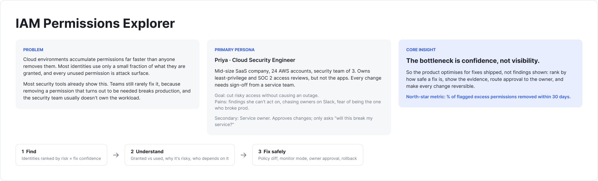
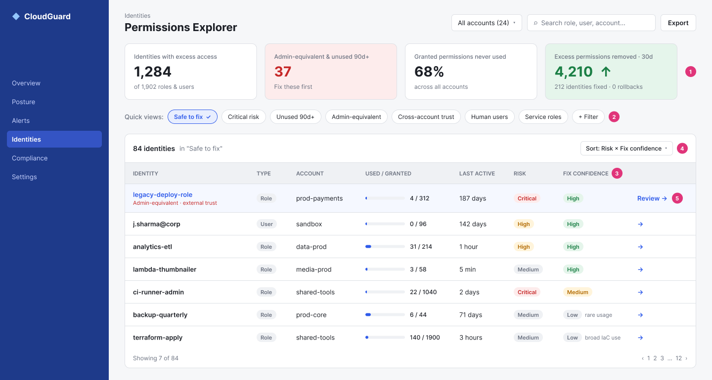
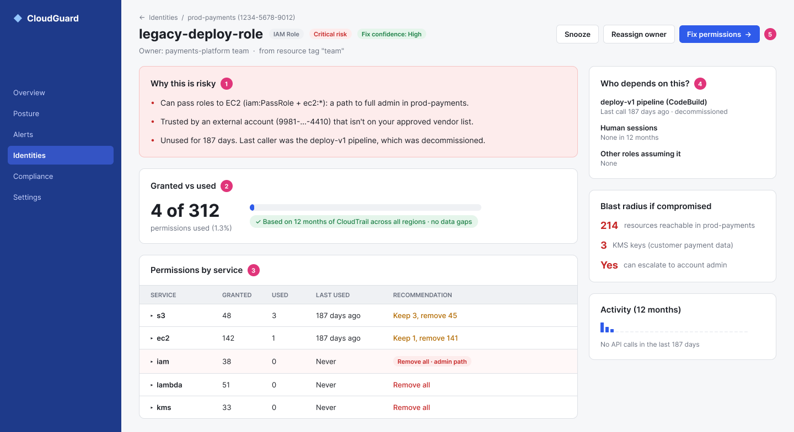
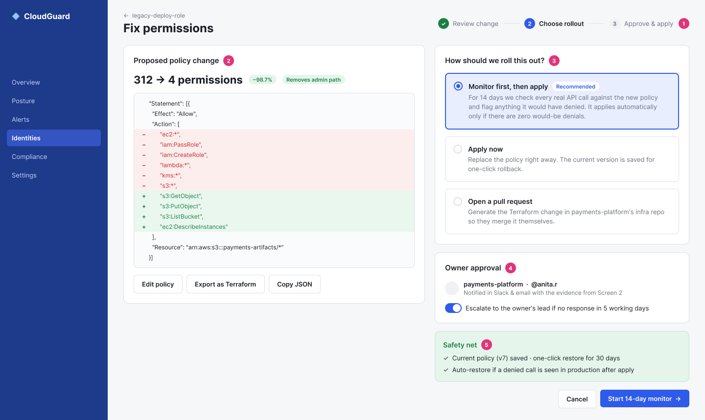

# IAM Permissions Explorer

**PM assignment - Option 3: Design a view to help identify and fix excessive or unused IAM permissions.**

**Submitted By:** Vedant Jeughale

## Problem statement

Cloud environments accumulate IAM permissions far faster than anyone removes them. Most identities use only a small fraction of what they are granted, and every unused permission is attack surface.

Existing tools already surface this. Teams still rarely fix it, because removing a permission that turns out to be needed breaks production, and the security team usually doesn't own the workload.

**Core insight: the bottleneck is confidence, not visibility.** The product therefore optimises for fixes shipped, not findings shown.

## User persona

**Priya: Cloud Security Engineer (primary).** Mid-size SaaS company, 24 AWS accounts, security team of 3. Owns least-privilege and SOC 2 access reviews but not the applications; every change needs sign-off from a service team.

- **Goal:** cut risky access without causing an outage.
- **Pains:** findings she can't act on, chasing owners on Slack, fear of being the one who broke prod.

**Service owner (secondary).** Approves changes and asks one question: "will this break my service?"

## Design flow

| Screen | Job | Key idea |
| --- | --- | --- |
| 1 · Find | Identities ranked by risk × fix confidence | Safe, high-impact fixes rise to the top; "Safe to fix" is the default view |
| 2 · Understand | Granted vs used, why it's risky, who depends on it | Plain-language evidence the security engineer can forward to the owner |
| 3 · Fix safely | Policy diff, rollout choice, owner approval, rollback | **Monitor mode** replays 14 days of real traffic against the new policy before applying |

Each screen in Figma has numbered pink pins that map to annotation cards explaining the design decision.

## North-star metric

**% of flagged excess permissions removed within 30 days**, guarded by rollback rate and zero remediation-caused incidents. Full metric set in [`WRITEUP.md`](WRITEUP.md#success-metrics).

## Write-up
  
[Assessment Write Up.pdf](Assessment%20Write%20Up.pdf): 1-page write-up, plus bonus development action items on page 2

## Figma Link

[Open the wireframes in Figma](https://www.figma.com/design/MneAEmAenGIkPWNhGSOInT/IAM-Permissions-Explorer--PM-Assignment)

## Mockup

### Overview: problem, persona and core insight

### Screen 1: Find what to fix first

Identities ranked by risk × fix confidence, with "Safe to fix" as the default view.

### Screen 2: Understand before acting

Granted vs used, plain-language risk reasons, dependents and blast radius.

### Screen 3: Fix it without fear

Policy diff, monitor-mode rollout, owner approval and rollback.

